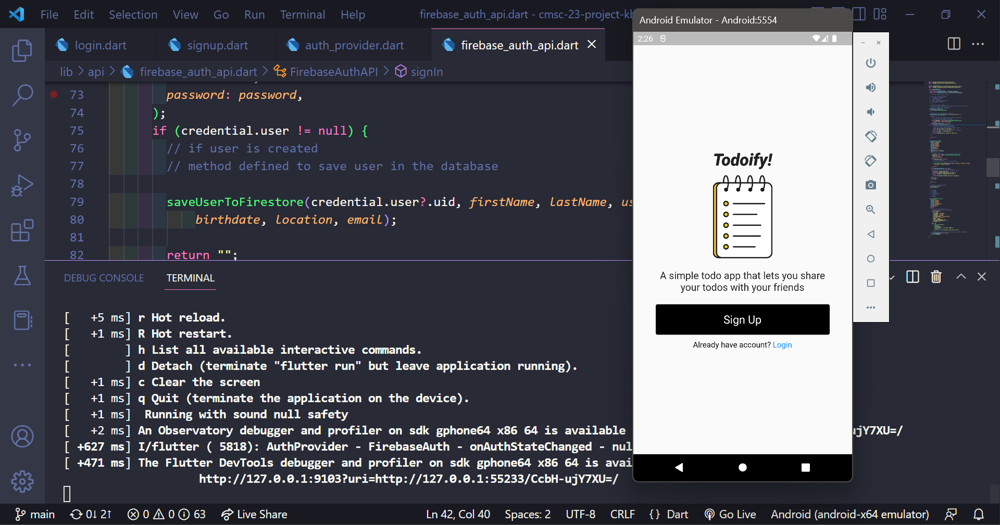
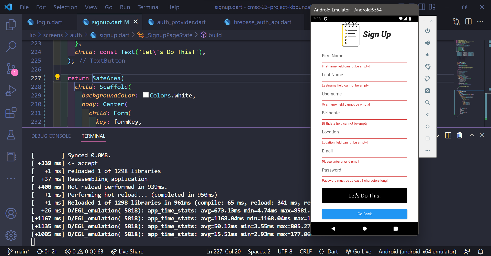
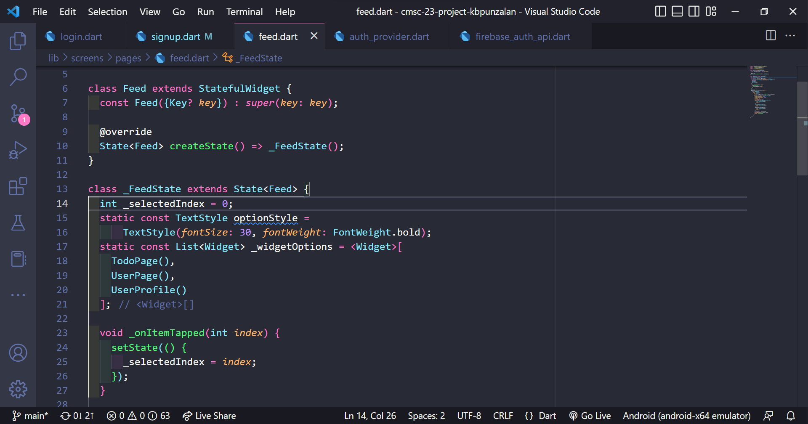
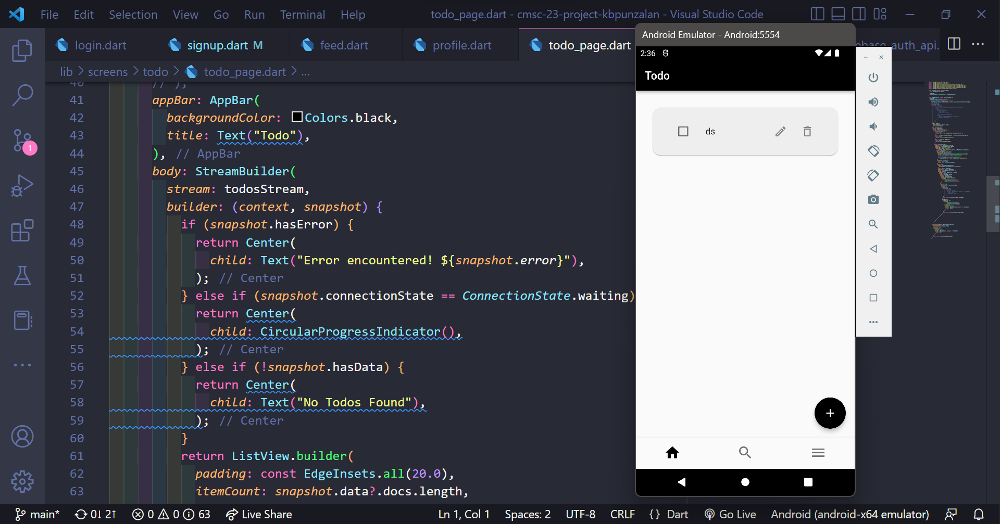
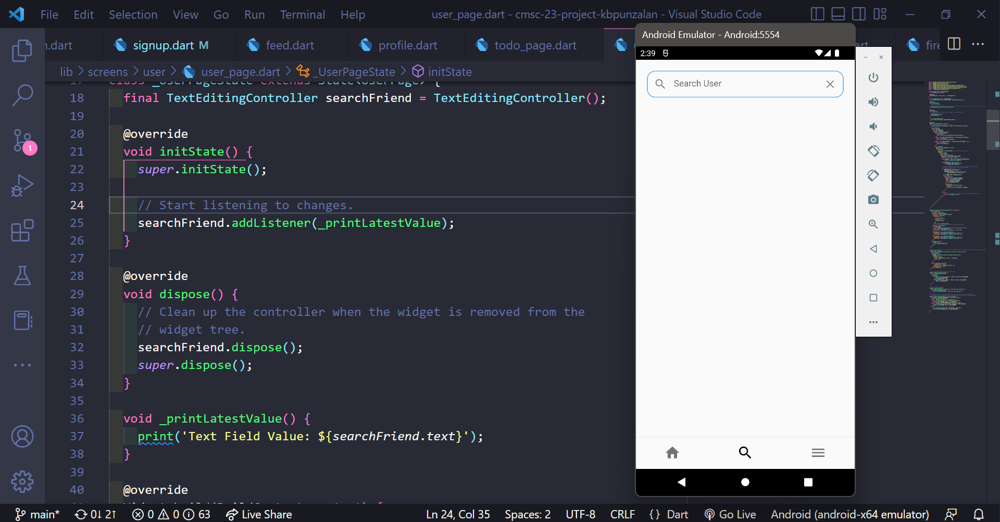
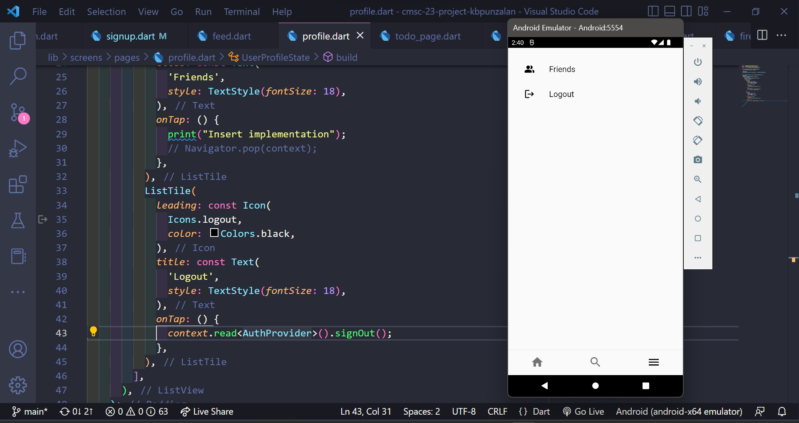

# Details
- Kurt Brian Daine B. Punzalan
- 2020-00772
- C4-L
- Project

# Screenshots (Milestone 2: UI and Navigation)
### Homepage

### Sign Up Page

### Login Page

### Feed (Bottom Navigation)

### Todo Page

### Search Friends Page

### Profile Page (Logout and other navigations)

# Things you did in the code (logic, solutions)
- added bottom navigation when signed in
- when not signed in, user will be directed to the homepage, else to the feed

# Challenges faced when developing the app

# Test Cases
