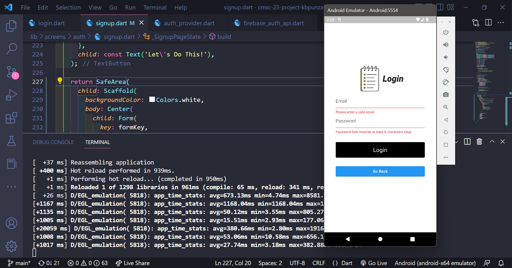

# Details
- Kurt Brian Daine B. Punzalan
- 2020-00772
- C4-L
- Project

# Screenshots (Milestone 2: UI and Navigation)
### Homepage

### Sign Up Page

### Login Page

### Feed (Bottom Navigation)

### Todo Page

### Search Friends Page

### Profile Page (Logout and other navigations)

# Things you did in the code (logic, solutions)
- SIGN UP: Let's create a new user; will be stored in the database (with validator for textfields)
- LOGIN: Will fetch for the user (provided that the credentials are correct; with validator for textfields) 
- when not signed in, user will be directed to the homepage, else to the feed
- The user feed (bottom navigation) contains the todo page of the main user, a field for searching a user, and the profile field
- TODO PAGE: You can add, edit, and delete your todos (assuming that you are the user)
- SEARCH: You can search a friend, add, and confirm/reject/cancel requests
- PROFILE:
  * Main Profile: Users can see their details; has and can update their bio
  * Friends: List all friends of the user; users can navigate to the todo of their friends and edit the todos.
  * Friend Requests: Users can see the details of users that sent friend requests to them; added actions such as confirm and reject
- LOGOUT BUTTON

# Challenges faced when developing the app
- I had problems on getting the current logged in user
- I also had problems on testing (with regards to using providers)

# Testing
- Widget testing was used in this project
- Use mock Firebase in testing
- Comment out provider calls in sign up and login buttons onpressed 

# Test Cases
* Happy Paths:
  * User will enter a valid email address in Sign Up and testing of the 
  * User will enter a valid password in Sign Up
  * User will be able to sign up using first name, last name, etc.
  * User will be able to login without any errors in the validator fields
* Unhappy Paths:
  * User will not enter a valid email structure when signing up
  * User will not be enter a valid password in sign up
  * User will not enter anything in the first name and last name fields of sign up
  * User will not enter anything in the login page or user will login an invalid email format or less than 8 characters for the password